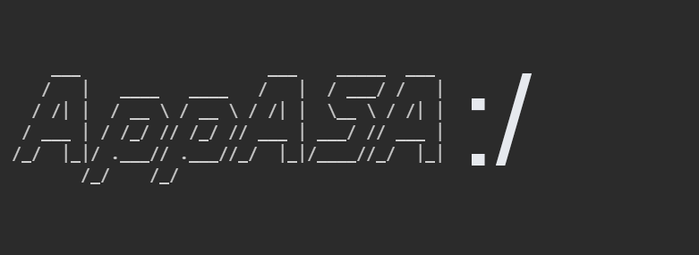
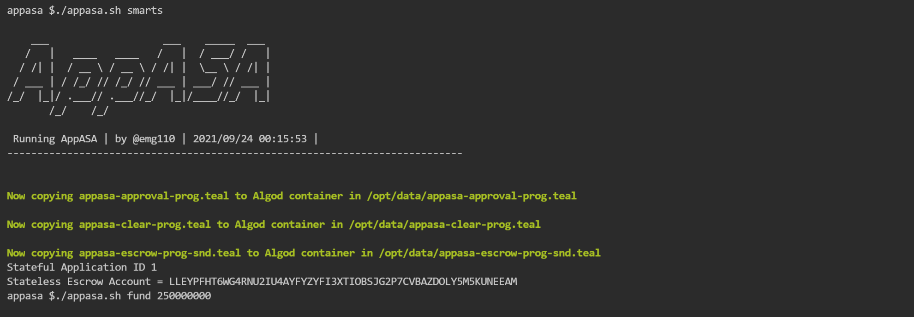
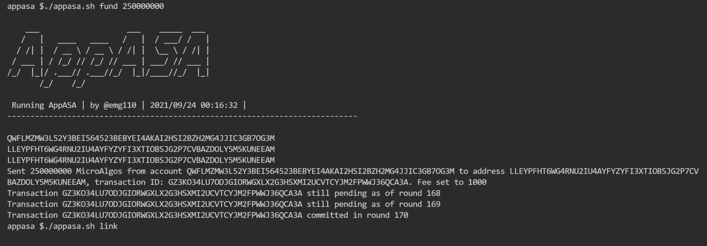
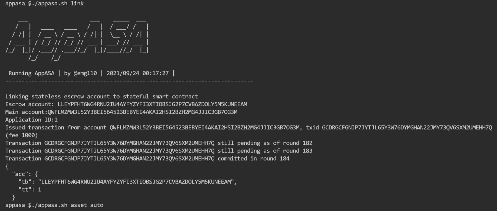
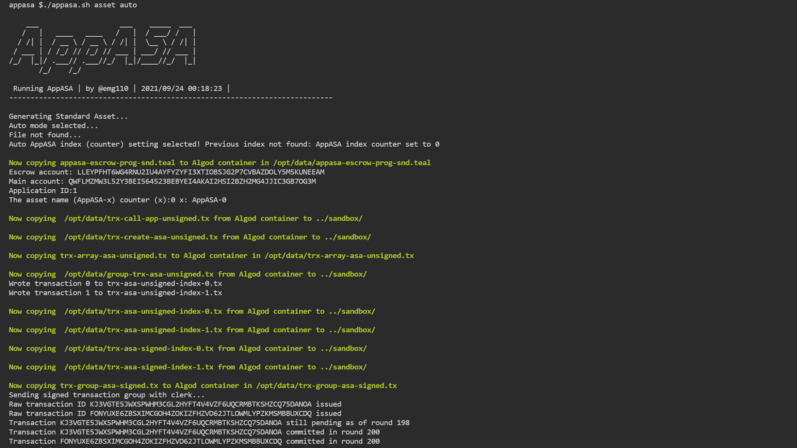
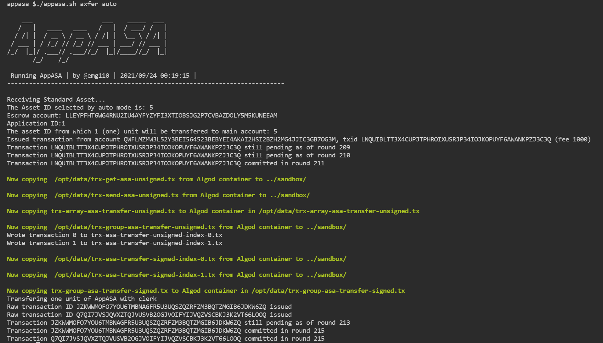

# AppASA
AppASA repository contains code solution plus tutorial content, prepared for Algorand's Developers Portal.
**DO NOT USE DIRECTLY IN PRODUCTION or MAINNET unless you know what you're doing!**

## Author

[@emg110 ](https://github.com/emg110)

Hi! MG here!

Many many thanks goes to **Jason, Ryan, Russ, Fabrice** and all Algorand & Algorand Foundation team for being insightful, willing, welcoming, accepting and guiding.

## Technical notes

> This repository uses [Algorand Sandbox](https://gtihub.com/algorand/sandbox) and assumes it exists already.

> Please install this repo **next to** the sandbox folder in your workspace.

> Run `chmod +x appasa.sh` in appasa folder to let the scripts run.

> Make sure you have a wallet and an active account under it, on sandbox, check [sandbox docs](https://github.com/algorand/sandbox) for more information.

> It's very important that the wallet you use for test and development does not have a password on it , otherwise the process will be intrupted and hangs.

### What does this demo do
This is a very simple demo tool built using bash script, Algorand's beautiful goal command line and TEAL 4 (No SDK used) in hope to be extendible and re-usable in future by Algorand dev community.

### What was exciting about this AppASA solution!
- Full featured command line to experience the power of Algorand in a classic way.

- TEAL is parametrized in CLI for this solution (on Application ID).
- Many featured demos out of the box & by a single command: Creating stateful smart contract, creating stateless smart contract

- It's sandboxed baby! This entire demo works on amazing [Algorand Sandbox](https://gtihub.com/algorand/sandbox).

### How to use AppASA
Easily! You can get AppASA solution demo up & running in no time because it uses [Algorand Sandbox](https://gtihub.com/algorand/sandbox) to provide demo enviromnet in no time!

- Clone this repository from GitHub to your workspace using:
  
   `git clone https://github.com/emg110/appasa`

- Run the bash script file inside using :

`./appasa.sh <Command> <Arg>` 

That's it! Have fun Algoranding using AppASA!

### Screen capture demos of main bounty feature mandates

#### Creating stateful smart contract application

#### Funding stateless escrow contract account and then linking stateful and stateless smart contracts (the app and the escrow)

#### Linking stateful and stateless smart contracts

#### Create Algorand Standard Asset with name AppASA-x (x being counter)

#### Transfering one unit of the created asset (or other created assets from escrow account assets) to main account on system

### List of commands (and their arguments if any)

#### Sandbox utilities
- For help, Run with help flag:

`./appasa.sh help` 

- To start sandbox:

`./appasa.sh start` 

- To stop sandbox:

`./appasa.sh stop` 

- To reset sandbox :

`./appasa.sh reset` 

#### Node utilities

- For node status :

`./appasa.sh status` 

- For list of transactions on node from indexer:

`./appasa.sh trxlist` 

- To check info on main account:

`./appasa.sh main` 

- To check info on escrow account:

`./appasa.sh escrow` 

- To check balance on main account:

`./appasa.sh mainbal` 

- To check info on escrow account:

`./appasa.sh escrowbal` 

### AppASA Solution Demo Process

**order of running is important to be as numbered!**

- 1- Create algorand smart contratcs (statefull app and stateless excrow) :

`./appasa.sh asc`

- 2- Fund escrow account in MicroAlgos (stateless smart contract) :

`./appasa.sh fund AMOUNT` e.g. `./appasa.sh fund 250000000` 

- 3- Link stateful smart contract and stateless smart contarcts (app & escrow) :

`./appasa.sh link`

- 4- Create the standard asset named AppASA-x (x being counter) :

`./appasa.sh asa COUNTER`e.g. `./appasa.sh asa 0` 

- 5- Transfer one unit of created AppASA-x to main account on system :

`./appasa.sh axfer ASSET_INDEX`e.g. `./appasa.sh axfer 13` 

