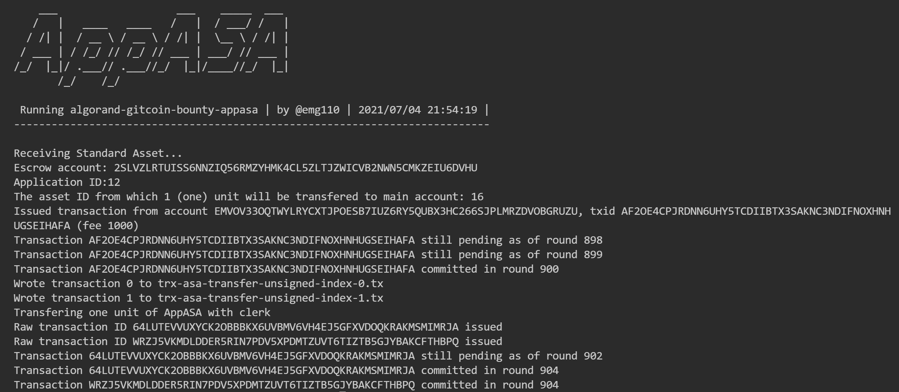
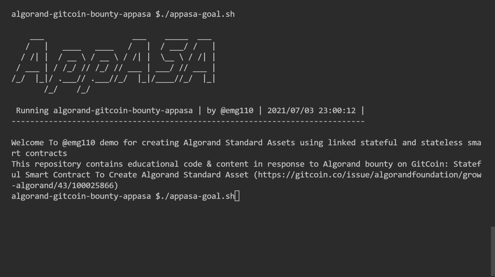

# AppASAn
AppASA repository contains code solution (DO NOT USE DIRECTLY IN PRODUCTION or MAINNET)  plus tutorial content, prepoared for Algorand's Developers Portal.

## Author

[@emg110 ](https://github.com/emg110)

Hi! MG here!

## Technical notes

#### This repository uses [Algorand Sandbox](https://gtihub.com/algorand/sandbox) therefore if already have it installed please clone this repo beside it (inside sandbox's upper parent folder).

## Thanks and appreciations
Many many thanks to Jason, Ryan, Russ, Fabrice and all Algorand & Algorand Foundation team for being willing, welcoming, accepting and guiding.

## What does this demo do
This is very simple demo tool built using shell script, Algorand's beautiful goal command line and TEAL 4 (No SDK used) in hope to be extendible and re-usable in future by Algorand dev community.

## What is exciting about this AppASA solution
- Full featured command line to experience the power of Algorand in a classic way.

- TEAL is parametrized in this solution demo implementation and APPLICATION ID is dymically set for smart contract before compile and therefore the process and the whole solution demo does not any manual settings or values or even default values per say(The only default values are those demanded by the bounty description e.g. only one unit of AppASA-x would be transfered to any requesting party).

- It's sandboxed baby! This entire demo works on amazing [Algorand Sandbox](https://gtihub.com/algorand/sandbox).

## How to use AppASA
Easily under 10 seconds you can get AppASA solution demo up & running because it uses [Algorand Sandbox](https://gtihub.com/algorand/sandbox) to provide demo enviromnet in no time!

- Clone this repository from GitHub to your workspace using:
  
   `git clone https://github.com/emg110/appasa`

- Run the bash script file inside using :

`./appasa-goal.sh <Command> <Arg>` 

That's it! Happy Algoranding using AppASA

## Screen capture demos of main bounty feature mandates

#### Creating stateful smart contract application

#### Funding stateless escrow contract account and then linking stateful and stateless smart contracts (the app and the escrow)

#### Create Algorand Standard Asset with name AppASA-x (x being counter)

#### Transfering one unit of the created asset (or other created assets from escrow account assets) to main account on system

## List of commands (and their arguments if any)

- If you have sandbox installed , install this repo beside the sandbox folder in your workspace please. if not, no worries! start from this repo you have it covered. Afer cloning start and :

#### Sandbox utilities
- For help, Run the bash script help command:

`./appasa-goal.sh help` 

- To install sandbox:

`./appasa-goal.sh install` 

- To start sandbox:

`./appasa-goal.sh start` 

- To stop sandbox:

`./appasa-goal.sh stop` 

- To reset sandbox :

`./appasa-goal.sh reset` 

#### Node utilities

- For node status :

`./appasa-goal.sh status` 

- For list of transactions on node from indexer:

`./appasa-goal.sh trxlist` 

- To check info on main account:

`./appasa-goal.sh main` 

- To check info on escrow account:

`./appasa-goal.sh escrow` 

- To check balance on main account:

`./appasa-goal.sh mainbal` 

- To check info on escrow account:

`./appasa-goal.sh escrowbal` 

#### AppASA Solution Demo Process

**order of running is important to be as numbered!**

- 1- Create algorand smart contratcs (statefull app and stateless excrow) :

`./appasa-goal.sh asc`

- 2- Fund escrow account in MicroAlgos (stateless smart contract) :

`./appasa-goal.sh fund AMOUNT` e.g. `./appasa-goal.sh fund 250000000` 

- 3- Link stateful smart contract and stateless smart contarcts (app & escrow) :

`./appasa-goal.sh link`

- 4- Create the standard asset named AppASA-x (x being counter) :

`./appasa-goal.sh asa COUNTER`e.g. `./appasa-goal.sh asa 0` 

- 5- Transfer one unit of created AppASA-x to main account on system :

`./appasa-goal.sh axfer ASSET_INDEX`e.g. `./appasa-goal.sh axfer 13` 

